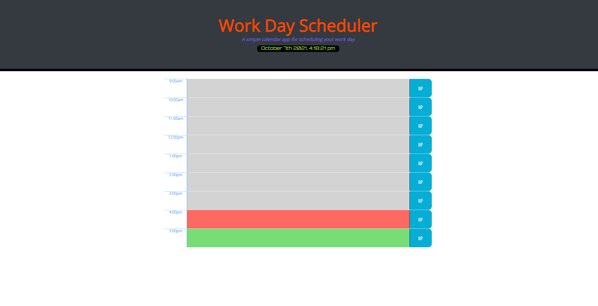

# Work_Day_Scheduler
This is a simple work day schedule, to keep track of appointments and time-blocking.  This was created with javascript, google fonts, jquery, and bootstrap.

## Live installation

https://silversssc.github.io/Work_Day_Scheduler/

## Installation

Use git clone to clone this repository to your local drive

'''bash
git clone "insert repo"
'''

## Contributing
Pull requests are welcome. For major changes, please open an issue first to discuss what you would like to change.

Please make sure to update tests as appropriate.

## License
[MIT](https://choosealicense.com/licenses/mit/)
